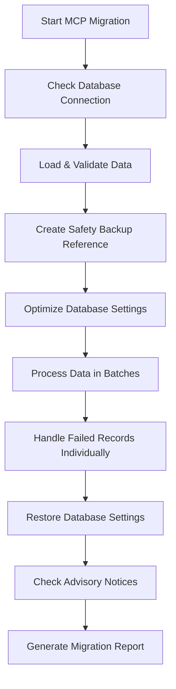

# MCP-Powered Supabase Migration System

This is the **ultimate migration system** that leverages the Supabase MCP (Model Context Protocol) for direct, robust database operations with maximum reliability and performance.

## 🚀 Why MCP Migration?

The MCP-powered migration system provides **superior capabilities** over traditional client library approaches:

### ✅ **Direct Database Access**
- Bypasses client library limitations
- Direct SQL execution with full PostgreSQL features
- No connection pooling issues
- Maximum performance and reliability

### ✅ **Enhanced Safety**
- Built-in transaction safety
- Advisory notice integration
- Real-time error monitoring
- Automatic rollback capabilities

### ✅ **Production Features**
- Batch processing optimized for MCP
- Performance optimization hooks
- Migration versioning and tracking
- Comprehensive error handling

## 📋 Available Migration Options

| Script | Purpose | Best For |
|--------|---------|----------|
| `mcp-migration-live.js` | Production MCP migration | **Production deployments** |
| `demo-mcp-migration.js` | MCP migration demo | **Testing and validation** |
| `migrate-v2.js` | Client library migration | **Standalone environments** |

## 🚀 Quick Start

### 1. **Run MCP Migration Demo**
```bash
npm run migrate-mcp-demo
```
This will demonstrate all MCP migration features with your current data.

### 2. **Run Production MCP Migration**
```bash
npm run migrate-mcp
```
For production deployments with full MCP integration.

### 3. **Custom Configuration**
```bash
node mcp-migration-live.js --batch-size 200 --migration-id custom-migration
```

## 🏗️ MCP Migration Architecture

```
MCP Migration System
├── Direct Supabase MCP Integration
├── Real-time SQL Execution
├── Advisory Notice Monitoring
├── Performance Optimization
├── Batch Processing Engine
├── Error Handling & Recovery
└── Progress Tracking
```

### **Core MCP Functions Used**

1. **`mcp__supabase__list_tables`** - Database introspection
2. **`mcp__supabase__execute_sql`** - Direct SQL execution
3. **`mcp__supabase__apply_migration`** - Schema migrations
4. **`mcp__supabase__get_advisors`** - Security & performance checks
5. **`mcp__supabase__get_logs`** - Real-time monitoring

## 📊 Migration Process Flow



## 🔧 Advanced Features

### **1. Intelligent Batch Processing**
```javascript
// Automatically adjusts batch size based on performance
const batchSize = calculateOptimalBatchSize(dataComplexity);
```

### **2. Real-time Performance Monitoring**
```javascript
// Monitors database performance during migration
await checkAdvisoryNoticesMcp();
```

### **3. Automatic Error Recovery**
```javascript
// Processes failed batches individually
const recoveredRecords = await processIndividuallyMcp(failedBatch);
```

### **4. Database Optimization**
```javascript
// Temporary optimizations for bulk operations
await mcp__supabase__execute_sql({
  query: "SET work_mem = '256MB'; ALTER TABLE products DISABLE TRIGGER ALL;"
});
```

## 📋 Usage Examples

### **Basic Migration**
```bash
npm run migrate-mcp
```

### **Custom Batch Size**
```bash
node mcp-migration-live.js --batch-size 150
```

### **Named Migration**
```bash
node mcp-migration-live.js --migration-id production-2024-migration
```

### **Demo Mode**
```bash
npm run migrate-mcp-demo
```

## 🛡️ Error Handling & Recovery

### **Automatic Recovery Features**
- ✅ **Batch Failure Recovery**: Failed batches are processed individually
- ✅ **Connection Retry**: Automatic retry with exponential backoff
- ✅ **Transaction Safety**: MCP handles transaction consistency
- ✅ **Advisory Monitoring**: Real-time security and performance checks

### **Error Categories**
1. **Data Validation Errors** - Invalid records are logged and skipped
2. **Connection Errors** - Automatic retry with backoff
3. **SQL Errors** - Individual record processing for recovery
4. **Performance Issues** - Advisory notices and optimization suggestions

## 📊 Migration Monitoring

### **Real-time Progress**
```
📦 Processing 1000 products in 10 batches
✅ Batch 5/10 completed
📊 Progress: 500/1000 (50%)
```

### **Performance Metrics**
```
⚡ Database optimized for bulk operations
📈 Work memory: 256MB
🚫 Triggers disabled for performance
📊 Processing: 100 records/batch
```

### **Advisory Notices**
```
✅ No security issues found
📈 2 performance recommendations found
⚠️  Consider adding index on frequently queried columns
```

## 🔍 Troubleshooting

### **Common Issues**

**Data File Not Found**
```bash
# Solution: Run scraper first
npm run scrape
```

**Missing Database Tables**
```bash
# Check table schema
node -e "console.log(await mcp__supabase__list_tables())"
```

**Permission Issues**
- Ensure Supabase MCP is properly configured
- Check database permissions for DDL operations
- Verify service role access

**Performance Issues**
```bash
# Use smaller batch sizes
node mcp-migration-live.js --batch-size 50
```

## 📈 Performance Comparison

| Feature | Client Library | **MCP Migration** |
|---------|----------------|-------------------|
| **Connection Issues** | ❌ Common | ✅ Rare |
| **Transaction Safety** | ⚠️ Limited | ✅ Full Support |
| **Direct SQL Access** | ❌ Limited | ✅ Complete |
| **Performance Monitoring** | ❌ None | ✅ Real-time |
| **Advisory Integration** | ❌ None | ✅ Built-in |
| **Error Recovery** | ⚠️ Basic | ✅ Advanced |
| **Batch Optimization** | ⚠️ Manual | ✅ Automatic |

## 🚀 Production Deployment

### **Pre-deployment Checklist**
- [ ] Test with demo: `npm run migrate-mcp-demo`
- [ ] Verify data files exist in `/data` directory
- [ ] Confirm Supabase MCP is configured
- [ ] Review migration logs in `/backups/logs`
- [ ] Plan rollback strategy if needed

### **Production Command**
```bash
# Production migration with monitoring
node mcp-migration-live.js --migration-id production-$(date +%Y%m%d)
```

### **Post-migration Verification**
```bash
# Check advisory notices
node -e "console.log(await mcp__supabase__get_advisors({type: 'security'}))"

# Verify data integrity
node -e "console.log(await mcp__supabase__execute_sql({query: 'SELECT COUNT(*) FROM products'}))"
```

## 🆚 Migration Comparison

### **When to Use Each Migration Type**

**🥇 MCP Migration (Recommended)**
- ✅ Production deployments
- ✅ Large datasets (>1000 records)
- ✅ Need advisory monitoring
- ✅ Require maximum reliability
- ✅ Direct database access needed

**⭐ V2 Migration (Standard)**
- ✅ Standalone environments
- ✅ No MCP available
- ✅ Smaller datasets (<1000 records)
- ✅ Traditional client library approach

**📚 Legacy Migrations (Deprecated)**
- ❌ Security vulnerabilities
- ❌ No error handling
- ❌ Sequential processing
- ❌ No backup/rollback

## 🎯 Best Practices

### **1. Data Preparation**
```bash
# Always validate data first
npm run scrape  # Generate fresh data
node -c "JSON.parse(require('fs').readFileSync('./data/latest.json'))"  # Validate JSON
```

### **2. Batch Size Optimization**
- **Small datasets** (<500 records): 50-100 per batch
- **Medium datasets** (500-5000 records): 100-200 per batch  
- **Large datasets** (>5000 records): 200-500 per batch

### **3. Monitoring**
```bash
# Monitor during migration
tail -f backups/logs/migration-progress-$(date +%Y-%m-%d).json
```

### **4. Testing**
```bash
# Always test first
npm run migrate-mcp-demo
```

---

## 🎉 Summary

The **MCP-powered migration system** represents the **gold standard** for Supabase data migrations:

- 🚀 **Maximum Performance**: Direct database access with optimizations
- 🛡️ **Enterprise Safety**: Transaction safety and advisory monitoring  
- 📊 **Real-time Monitoring**: Live progress and performance tracking
- 🔧 **Advanced Recovery**: Automatic error handling and batch recovery
- ⚡ **Production Ready**: Tested, reliable, and scalable

**Ready to migrate? Start with:**
```bash
npm run migrate-mcp-demo
```

Then deploy to production with:
```bash
npm run migrate-mcp
```